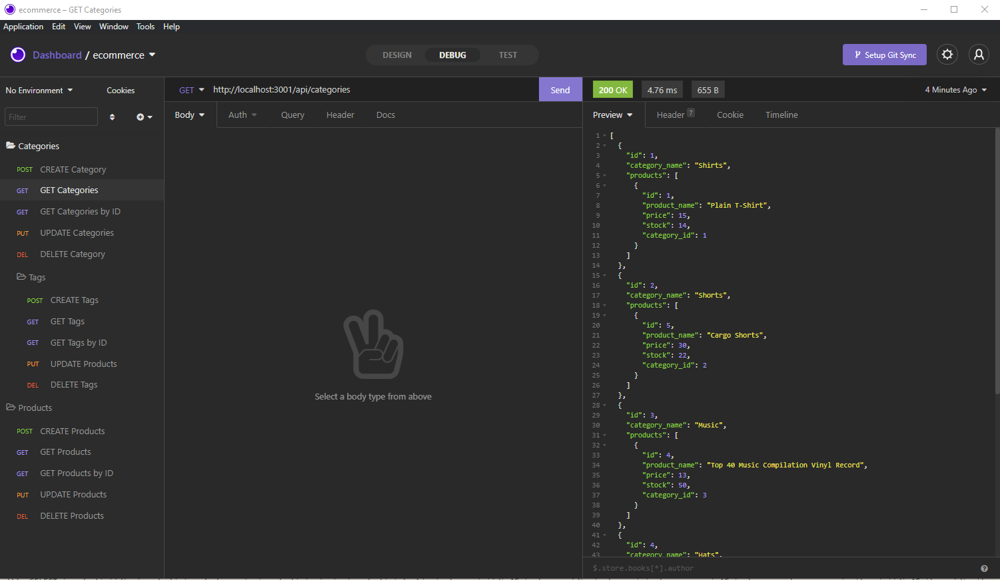

# E-Commerce Back End

## Description
A javascript built ecommerce app that helps keep track and manage inventory by using express, sequelize, mysql2, and dotenv. It lets you view, create, update, and delete categories, tags and products in your database..

## Demo Pic:

## Table of Contents

- [Installation](#installation)
- [Usage](#usage)
- [Video Walkthrough](#video)
- [License](#license)

## Installation
npm i Sequelize, Dotenv, Mysql2, express

## Usage

_Instructions for use:_
Use mysql -u root -p to source db schema,
exit and run npm run seed in the root of file,
npm start to initialize localhost

## Video Walkthrough
https://drive.google.com/file/d/1YMsg3AcGRs6y_PP6o8NxM99wbgcxXjFb/view?usp=sharing

## License

Open

### Questions?

For any questions, please contact me with the information below:

GitHub: [@babelitoo](https://github.com/babelitoo)
